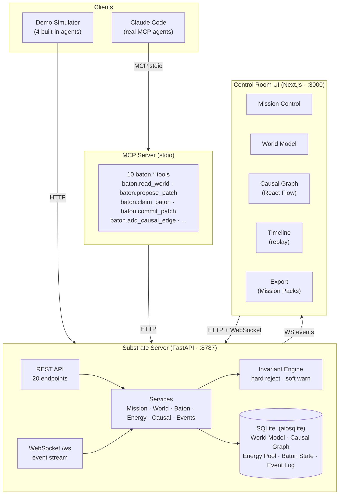
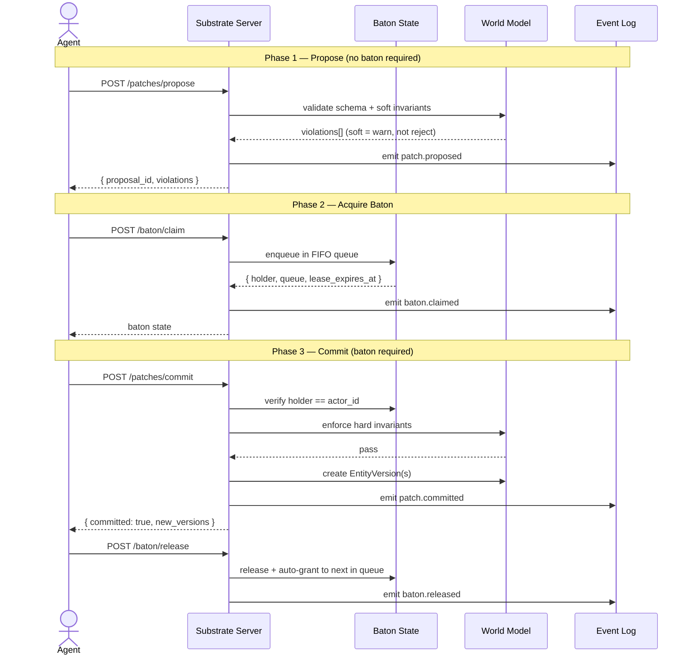
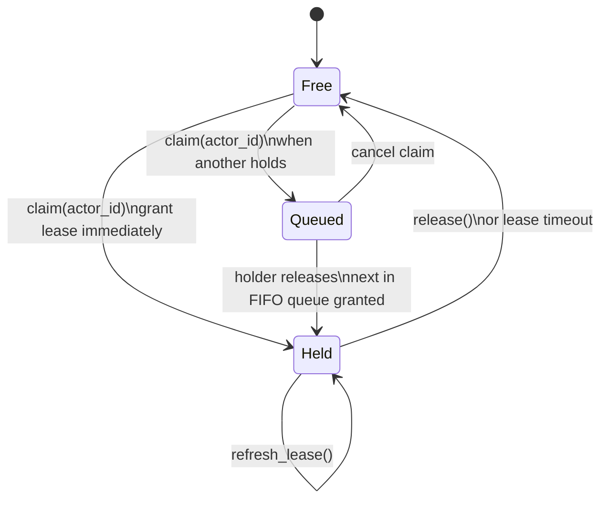
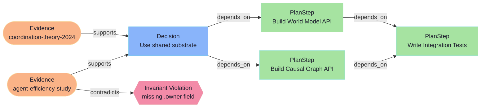
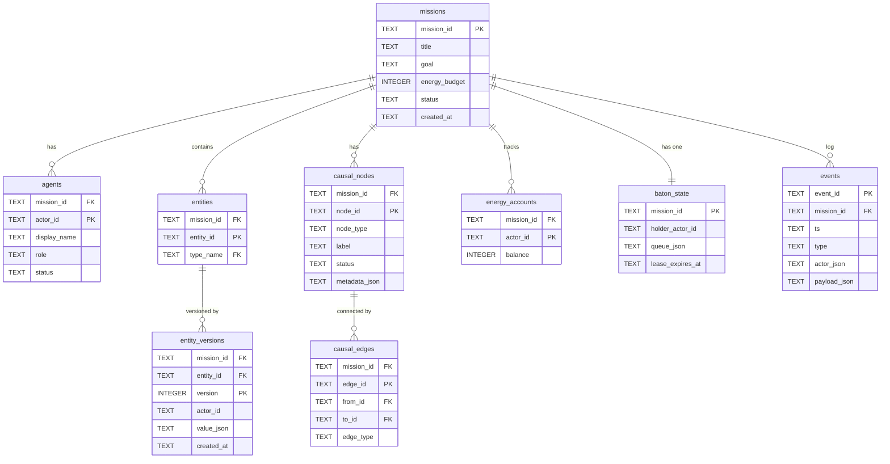

<div align="center">

<pre>
  ██████╗  █████╗ ████████╗ ██████╗ ███╗   ██╗
  ██╔══██╗██╔══██╗╚══██╔══╝██╔═══██╗████╗  ██║
  ██████╔╝███████║   ██║   ██║   ██║██╔██╗ ██║
  ██╔══██╗██╔══██║   ██║   ██║   ██║██║╚██╗██║
  ██████╔╝██║  ██║   ██║   ╚██████╔╝██║ ╚████║
  ╚═════╝ ╚═╝  ╚═╝   ╚═╝    ╚═════╝ ╚═╝  ╚═══╝

 ███████╗████████╗██╗   ██╗██████╗ ██╗ ██████╗
 ██╔════╝╚══██╔══╝██║   ██║██╔══██╗██║██╔═══██╗
 ███████╗   ██║   ██║   ██║██║  ██║██║██║   ██║
 ╚════██║   ██║   ██║   ██║██║  ██║██║██║   ██║
 ███████║   ██║   ╚██████╔╝██████╔╝██║╚██████╔╝
 ╚══════╝   ╚═╝    ╚═════╝ ╚═════╝ ╚═╝ ╚═════╝
</pre>

### The Control Room for Multi-Agent Teams

*See who holds the baton. See why decisions were made. See the budget burn. Replay any mission.*

[](#testing)
[](https://www.python.org/)
[](https://nodejs.org/)
[](https://fastapi.tiangolo.com/)
[](https://nextjs.org/)
[](LICENSE)

---

| [Quickstart](#quickstart) | [Demo](#demo-walkthrough) | [Architecture](#architecture) | [MCP Integration](#mcp-integration) | [Docs](#documentation) |

---

</div>

> **For anyone:** Baton Studio is a "mission control" dashboard that makes AI agent teamwork *visible* — who's doing what, why they made each decision, and how much of the budget they've spent.
>
> **For engineers:** It's a typed shared substrate (world model + causal graph + energy pool + conflict-free write protocol) with a real-time Control Room UI and an MCP server so Claude Code agents can coordinate through explicit shared state instead of text messages.

---

## The Problem with Agent Teams Today

Most "multi-agent" setups look like this:

```
Agent A → "I think we should use Postgres" (message)
Agent B → "I already switched to MySQL" (message)
Agent C → "The schema is now updated" (overwrote A's work)
```

Coordination happens through **text**. Typed structures collapse into prose. Agents contradict each other silently. There's no record of *why* a decision was made. No budget control. No conflict resolution. Just chaos in a chat window.

**The result:** information loss, consistency failures, and coordination overhead that grows faster than your agent count.

---

## The Solution: Four Shared Primitives

Baton Studio gives your agent team a *shared brain* — four explicit structures that replace text-passing:

```
┌─────────────────────────────────────────────────────────────────┐
│                                                                 │
│  1. SHARED WORLD MODEL          2. SHARED CAUSAL GRAPH          │
│  ─────────────────────          ───────────────────────         │
│  Typed entities with            Nodes: evidence, decisions,     │
│  JSON schemas + invariants.     plan steps, entity versions.    │
│  Every mutation versioned.      Edges: supports, depends_on,    │
│  Hard violations rejected.      contradicts, derived_from,      │
│  Soft violations queued.        invalidates.                    │
│                                 Upstream changes ripple down.   │
│                                                                 │
│  3. SHARED ENERGY POOL          4. BATON ARBITRATION            │
│  ──────────────────────         ──────────────────────          │
│  Per-mission + per-agent        A visible mutex with a UX.      │
│  budget tracking.               Holder, queue, timeout.         │
│  Allocate, spend, throttle.     Propose without baton.          │
│  SC score penalizes waste.      Commit only with baton.         │
│                                 No silent overwrites. Ever.     │
│                                                                 │
└─────────────────────────────────────────────────────────────────┘
```

---

## Architecture

Three runtime components, all local-first:



---

## The Write Protocol

Every state change in Baton Studio follows a two-phase flow: **propose** (anyone, no baton needed) then **commit** (baton holder only). This makes write conflicts impossible.



---

## Baton Arbitration

The baton is a **lease-based mutex with a UX**. Not a lock file. Not a semaphore. A first-class system primitive you can see, inspect, and reason about.



- **Lease timeout** — no deadlocks; a stuck agent auto-releases after `lease_ms`
- **FIFO queue** — fair ordering; optional priority weighting by energy balance
- **Forced release** — system can reclaim the baton from a crashed agent
- **Visible in HUD** — the UI always shows current holder + queue depth

---

## The Causal Graph

Every decision, evidence item, plan step, and entity version is a **node**. Every dependency between them is a **typed edge**. When you update a node, all downstream nodes are marked stale — automatically.



**Invalidation cascade:** update `Decision → Use shared substrate` and every downstream PlanStep is automatically marked `stale`. No agent can commit on top of stale ancestry without re-acknowledging the change.

**Five node types:** Evidence · Decision · PlanStep · WorldObjectVersion · InvariantViolation

**Five edge types:** `supports` · `contradicts` · `depends_on` · `derived_from` · `invalidates`

---

## Structural Continuity Score

Baton Studio computes a real-time stability metric — **SC(t)** — that penalizes coordination failures:

```
SC(t) = exp( −0.3·V(t) − 0.2·I(t) − 0.1·R(t) )

  V(t)  =  stale / invalidated causal nodes at time t
  I(t)  =  invariant violations at time t  (hard weighted 2×)
  R(t)  =  rejected patches at time t

SCk   =  rolling average of SC over the last k events
```

A perfect mission scores **1.0**. Contested missions with cascading invalidations trend toward 0. The HUD shows the live SC score and a sparkline over time.

---

## Quickstart

**Prerequisites:** Python 3.11+ with [uv](https://docs.astral.sh/uv/) · Node 20+ with [pnpm](https://pnpm.io/)

```bash
# 1. Clone and enter
git clone <repo-url> baton-studio && cd baton-studio

# 2. Start everything
make dev
# Backend → http://localhost:8787
# Frontend → http://localhost:3000

# 3. Open the Control Room
open http://localhost:3000
```

Click **Load Demo Mission**, then **Start Simulation** — and watch four agents coordinate live.

> No API keys required for demo mode. The backend auto-creates the SQLite database on first run.

### Individual services

```bash
# Backend only
cd backend && uv sync --dev
uv run uvicorn baton_substrate.api.main:app --reload --port 8787

# Frontend only
cd frontend && pnpm install && pnpm dev
```

### Quality checks

```bash
make check   # ruff + mypy + pytest + eslint + tsc  (all 70 tests)
make e2e     # Playwright end-to-end tests           (requires make dev)
make demo    # Demo simulator + export mission pack
```

---

## Demo Walkthrough

When you click **Load Demo Mission** + **Start Simulation**, four agents execute a scripted mission with deliberate conflict moments:

```
┌─────────────────────────────────────────────────────────────────┐
│                                                                 │
│  STEP 1 — RESEARCH                                              │
│  Atlas proposes Evidence entities (coordination theory,         │
│  efficiency benchmarks) and connects them to the causal graph.  │
│                                                                 │
│  STEP 2 — PLANNING                                              │
│  Meridian claims the baton and commits PlanSteps for the        │
│  substrate architecture. Baton transfer animates in HUD.        │
│                                                                 │
│  STEP 3 — CONTENTION  ← watch this in the HUD                  │
│  Forge and Meridian both claim the baton simultaneously.        │
│  One enters the queue. You see the queue depth change.          │
│                                                                 │
│  STEP 4 — CRITIQUE                                              │
│  Sentinel adds "contradicts" edges, triggering a soft           │
│  invariant violation toast. Graph auto-focuses to the chain.    │
│                                                                 │
│  STEP 5 — IMPLEMENTATION                                        │
│  Forge commits CodeArtifacts with "derived_from" edges back     │
│  to the Evidence and Decision nodes.                            │
│                                                                 │
│  STEP 6 — INVALIDATION CASCADE                                  │
│  An upstream Evidence node is updated. All downstream           │
│  PlanSteps and Decisions flip to "stale". SC score drops.       │
│                                                                 │
│  STEP 7 — ENERGY DEPLETION                                      │
│  One agent exhausts its budget. Energy bars animate to zero.    │
│  System throttles further commits from that agent.              │
│                                                                 │
└─────────────────────────────────────────────────────────────────┘
```

**After the simulation**, export the Mission Pack (`snapshot + causal graph + event log`) and reload it in Timeline for deterministic replay.

---

## Five Screens

### Mission Control — the home base

> *Who holds the baton right now? What's the SC score? Which agent last caused a violation?*

The top HUD is always visible across all screens:

```
┌──────────────────────────────────────────────────────────────────┐
│  BATON STUDIO  │  Substrate-Native Coordination  [Running ▶]     │
│                │                                                  │
│  Baton: [Meridian ●]  Queue: 1  │  Energy: 743/1000  │  SC: 0.87 │
│  Backend: ●  MCP: ●                                               │
└──────────────────────────────────────────────────────────────────┘
```

Below the HUD: four **agent cards** (role, current activity, energy bar, last commit), mission KPIs, and CTAs.


---

### World Model — the typed state

> *What entities exist? What changed in version 3 vs version 2? Which agent owns this object?*

- Left: entity list grouped by type (Evidence, PlanStep, Decision, CodeArtifact)
- Center: selected entity with full version history (inline diff between versions)
- Right inspector: JSON schema, invariants, causal provenance

Filter by type, tag, owner agent, or "changed in last N minutes". Toggle between Proposals and Committed.


---

### Causal Graph — the wow view

> *Why did this decision get made? What depends on this plan step? What broke the invariant?*

An interactive React Flow graph. Click any node to pin it in the inspector. Use **lenses** to overlay:

- "Show only disputed nodes"
- "Show stale / invalidation chain"
- "Show agent attribution heatmap"

Keyboard shortcuts: `/` to search nodes, `j` / `k` to navigate.


---

### Timeline — the event stream

> *What happened in what order? Let me replay from before the invalidation cascade.*

- Scrollable virtualized event stream (baton transfers, proposals, commits, violations, energy spends)
- Time scrubber with play / pause / step controls
- Jump to: next violation · next baton transfer
- **Replay mode**: load a Mission Pack and replay deterministically at any speed

---

### Export / Mission Packs

Export a complete snapshot of any mission:

```
mission-pack-20260306/
├── mission.json          # title, goal, status, energy budget
├── world_snapshot.json   # all entity types + latest versions
├── causal_graph.json     # all nodes + edges
├── events.ndjson         # append-only event log
└── schemas.json          # entity type schemas + invariants
```

Generate a `report.html` single-file summary for sharing with stakeholders.

---

## MCP Integration

Connect any Claude Code agent to Baton Studio in two steps:

### Step 1 — Add the MCP server

```bash
# In your Claude Code project
claude mcp add baton-studio -- \
  uv run --project /path/to/baton-studio/mcp_server \
  python -m baton_mcp.main

# Or set env var for remote backend
BATON_BACKEND_URL=http://localhost:8787 claude mcp add baton-studio -- ...
```

### Step 2 — Instruct your agents

```
You are part of a multi-agent team coordinating through Baton Studio.

Before making changes:
  1. Read the world model:   baton.read_world(mission_id)
  2. Propose your patch:     baton.propose_patch(mission_id, actor_id, patch)
  3. Acquire the baton:      baton.claim_baton(mission_id, actor_id)
  4. Commit your proposal:   baton.commit_patch(mission_id, actor_id, proposal_id)
  5. Release the baton:      baton.release_baton(mission_id, actor_id)
  6. Add causal context:     baton.add_causal_edge(mission_id, from_id, to_id, "supports")
```

### Available MCP tools

| Tool | Purpose |
|------|---------|
| `baton.health` | Check backend connectivity |
| `baton.list_types` | List entity schemas + invariants |
| `baton.read_world` | Get full world snapshot |
| `baton.propose_patch` | Submit a patch (no baton needed) |
| `baton.claim_baton` | Acquire write rights |
| `baton.release_baton` | Release write rights |
| `baton.commit_patch` | Commit a proposal (baton required) |
| `baton.add_causal_edge` | Link nodes in the causal graph |
| `baton.energy_balance` | Check agent budget |
| `baton.energy_spend` | Record an energy expenditure |

Full spec: [docs/MCP_SPEC.md](docs/MCP_SPEC.md)

---

## Data Model



Full schema: [docs/DATA_MODEL.md](docs/DATA_MODEL.md)

---

## Repo Structure

```
baton-studio/
│
├── backend/                         # FastAPI substrate server
│   ├── baton_substrate/
│   │   ├── api/                     # HTTP routes (20 endpoints) + WebSocket
│   │   ├── db/                      # SQLAlchemy async engine + schema
│   │   ├── demo/                    # Deterministic demo simulator
│   │   │   ├── simulator.py         # 7-step scripted mission
│   │   │   ├── agent_behaviors.py   # Atlas · Meridian · Sentinel · Forge
│   │   │   └── schema_pack.py       # Default entity types + invariants
│   │   ├── invariants/              # Hard + soft invariant engine
│   │   ├── models/                  # Pydantic request/response types
│   │   ├── services/                # Business logic (mission, world, baton, ...)
│   │   └── ws/                      # WebSocket connection manager
│   └── tests/                       # 70 pytest tests (unit + integration)
│
├── frontend/                        # Next.js 14 Control Room UI
│   └── src/
│       ├── app/                     # App router pages
│       ├── components/
│       │   ├── graph/               # React Flow causal graph + custom nodes
│       │   ├── hud/                 # Top HUD: baton pill, energy bars, status
│       │   ├── layout/              # AppShell, NavRail, InspectorDrawer
│       │   ├── mission/             # HeroPanel, SquadStrip, AgentCard, KPIs
│       │   ├── timeline/            # Virtualized event stream + scrubber
│       │   └── world/               # Entity list, version diff, schema inspector
│       └── lib/
│           ├── api/                 # Typed fetch wrappers for all endpoints
│           ├── hooks/               # useMission, useBaton, useTimeline, ...
│           └── state/               # React context for mission + event bus
│
├── mcp_server/                      # Python stdio MCP server
│   └── baton_mcp/
│       ├── server.py                # Tool registrations
│       ├── client.py                # httpx backend client
│       └── tools/                   # One file per tool group
│
├── docs/
│   ├── PRD.md                       # Product requirements
│   ├── ARCHITECTURE.md              # Technical architecture
│   ├── API_SPEC.md                  # Full HTTP + WS API contract
│   ├── DATA_MODEL.md                # SQLite schema
│   ├── MCP_SPEC.md                  # MCP tool definitions
│   ├── UX_SPEC.md                   # UI specification (non-negotiable)
│   ├── ACCEPTANCE_CHECKLIST.md      # Definition of done
│   └── TROUBLESHOOTING.md           # Common issues + fixes
│
├── assets/
│   ├── brand/                       # Logo + brand assets
│   ├── diagrams/                    # Architecture diagrams
│   └── ui/                          # Screenshots (generated by make e2e)
│
├── Makefile                         # dev · check · e2e · demo
└── CONTRIBUTING.md                  # How to contribute
```

---

## Tech Stack

| Layer | Technology | Why |
|-------|-----------|-----|
| **Backend framework** | [FastAPI](https://fastapi.tiangolo.com/) | Async, typed, fast. WebSocket support built in. |
| **Database** | SQLite + [aiosqlite](https://github.com/omnilib/aiosqlite) | Local-first, zero-infra, deterministic export. |
| **ORM** | [SQLAlchemy 2.0](https://www.sqlalchemy.org/) async | Full async, typed queries, schema management. |
| **Validation** | [Pydantic v2](https://docs.pydantic.dev/) | Schema-bound request/response on every endpoint. |
| **Python runtime** | [uv](https://docs.astral.sh/uv/) | 10× faster than pip, lockfile reproducibility. |
| **Frontend framework** | [Next.js 14](https://nextjs.org/) App Router | File-based routing, React Server Components, fast. |
| **UI library** | [React 18](https://react.dev/) | Concurrent features, Suspense, transitions. |
| **Styling** | [Tailwind CSS v3](https://tailwindcss.com/) | Design system in config, zero runtime CSS. |
| **Graph visualization** | [React Flow](https://reactflow.dev/) + [Dagre](https://github.com/dagrejs/dagre) | Production-grade interactive graph + auto-layout. |
| **Animation** | [Framer Motion](https://www.framer.com/motion/) | Spring physics for baton transfers + energy drains. |
| **List virtualization** | [@tanstack/react-virtual](https://tanstack.com/virtual) | 60fps timeline with 10k+ events. |
| **Node runtime** | Node 20 + [pnpm](https://pnpm.io/) | Fast installs, strict lockfile, workspace support. |
| **MCP server** | [mcp](https://github.com/modelcontextprotocol/python-sdk) Python SDK | Stdio transport for Claude Code integration. |
| **E2E tests** | [Playwright](https://playwright.dev/) | Cross-browser, reliable, screenshot capture. |
| **Linting** | [Ruff](https://docs.astral.sh/ruff/) + [ESLint](https://eslint.org/) | Blazing fast, opinionated, zero-config. |
| **Type checking** | [mypy](https://mypy.readthedocs.io/) strict + [tsc](https://www.typescriptlang.org/) strict | Catch bugs at compile time, not production. |

---

## Testing

```bash
make check     # Full quality gate: lint + type check + unit tests
make e2e       # Playwright smoke + feature tests (requires running servers)
```

**Backend (pytest + pytest-asyncio):**
- `test_invariant_engine.py` — hard/soft invariant enforcement
- `test_baton_service.py` — claim, queue, timeout, contention
- `test_energy_service.py` — allocation, spending, depletion
- `test_causal_service.py` — invalidation cascade BFS
- `test_patch_service.py` — propose + commit lifecycle
- `test_metrics_service.py` — SC score computation
- `test_api_flow.py` — full HTTP lifecycle integration
- `test_demo_simulator.py` — end-to-end demo run

**Frontend (Playwright):**
- `smoke.spec.ts` — navigation, HUD, branding
- `mission-control.spec.ts` — load demo, start simulation
- `world-model.spec.ts` — entity types, version history
- `causal-graph.spec.ts` — node/edge counts, interactions
- `timeline.spec.ts` — event stream, replay controls
- `screenshots.spec.ts` — capture to `assets/ui/`

---

## Documentation

| Document | Audience | Contents |
|----------|----------|----------|
| [PRD.md](docs/PRD.md) | Product | Goals, personas, journeys, success criteria |
| [ARCHITECTURE.md](docs/ARCHITECTURE.md) | Engineering | System design, data flows, write protocols |
| [API_SPEC.md](docs/API_SPEC.md) | Engineering | Full HTTP + WebSocket API contract with examples |
| [DATA_MODEL.md](docs/DATA_MODEL.md) | Engineering | SQLite schema (11 tables), export format |
| [MCP_SPEC.md](docs/MCP_SPEC.md) | Agent authors | MCP tool definitions, inputs/outputs, error codes |
| [UX_SPEC.md](docs/UX_SPEC.md) | Design + Eng | 5 screens, micro-interactions, motion, a11y |
| [ACCEPTANCE_CHECKLIST.md](docs/ACCEPTANCE_CHECKLIST.md) | All | Definition of done for MVP |
| [TROUBLESHOOTING.md](docs/TROUBLESHOOTING.md) | All | Common issues and fixes |
| [CONTRIBUTING.md](CONTRIBUTING.md) | Contributors | Dev setup, conventions, PR process |

---

## FAQ

<details>
<summary><b>Does this replace LangGraph / CrewAI / AutoGen?</b></summary>

No. Baton Studio is a *coordination substrate*, not an agent framework. It doesn't run agents — it gives agents a shared place to coordinate. You can wire it to any framework that supports MCP or HTTP.
</details>

<details>
<summary><b>Does it require a cloud backend or API keys?</b></summary>

No. Everything runs locally on SQLite. Demo mode doesn't require any API keys — the simulated agents are pure Python. Real agent mode requires only that your MCP client (Claude Code) can reach `localhost:8787`.
</details>

<details>
<summary><b>Can multiple humans share one substrate?</b></summary>

For MVP, the substrate is single-machine. The WebSocket event stream means multiple browser tabs (or humans on the same machine) see real-time updates. Multi-machine distribution is a post-MVP scope item.
</details>

<details>
<summary><b>How do I add my own entity types?</b></summary>

Use the API: `POST /missions/{id}/world/types` with your JSON schema and invariant rules. Or extend `backend/baton_substrate/demo/schema_pack.py` for demo mode. The invariant engine validates all writes against your schema automatically.
</details>

<details>
<summary><b>What happens if an agent crashes while holding the baton?</b></summary>

The baton has a configurable `lease_ms`. When the lease expires, the baton is auto-released and the next agent in the FIFO queue gets it. No deadlocks.
</details>

---

## Contributing

See [CONTRIBUTING.md](CONTRIBUTING.md) for the full guide. The short version:

```bash
# 1. Fork and clone
git clone <your-fork> && cd baton-studio

# 2. Set up dev environment
make dev

# 3. Run quality checks before committing
make check

# 4. Submit a PR with a clear description of what and why
```

We welcome: bug fixes, new entity type examples, MCP client libraries, frontend polish, documentation improvements.

---

## License

MIT — see [LICENSE](LICENSE). Adjust for your organization.

---

<div align="center">

**Built for the next generation of agent coordination.**

*From text-passing chaos to substrate-native clarity.*

</div>
