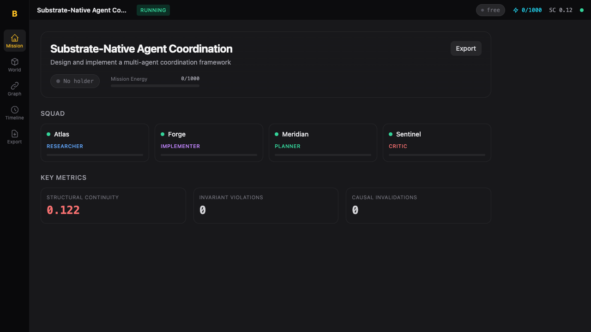
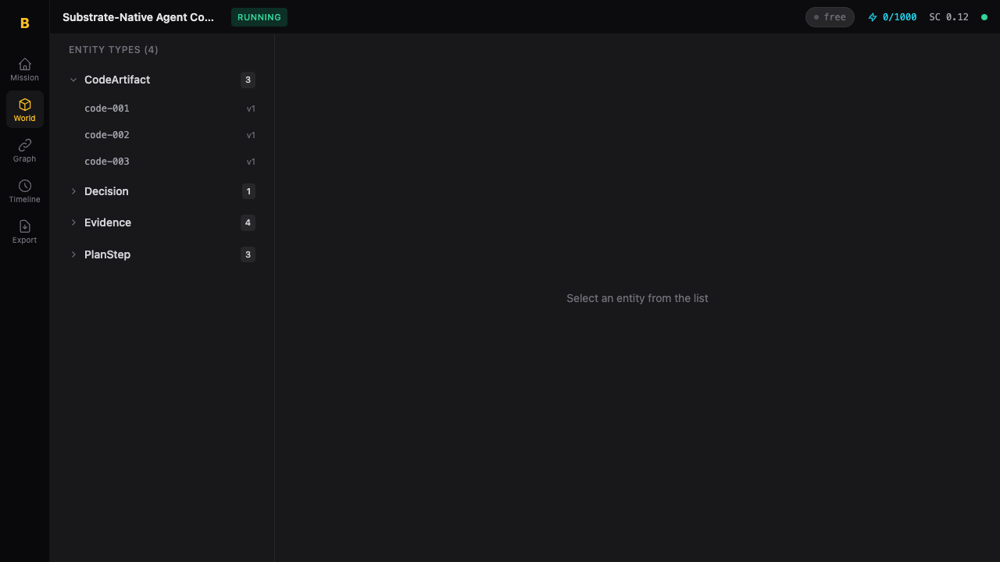
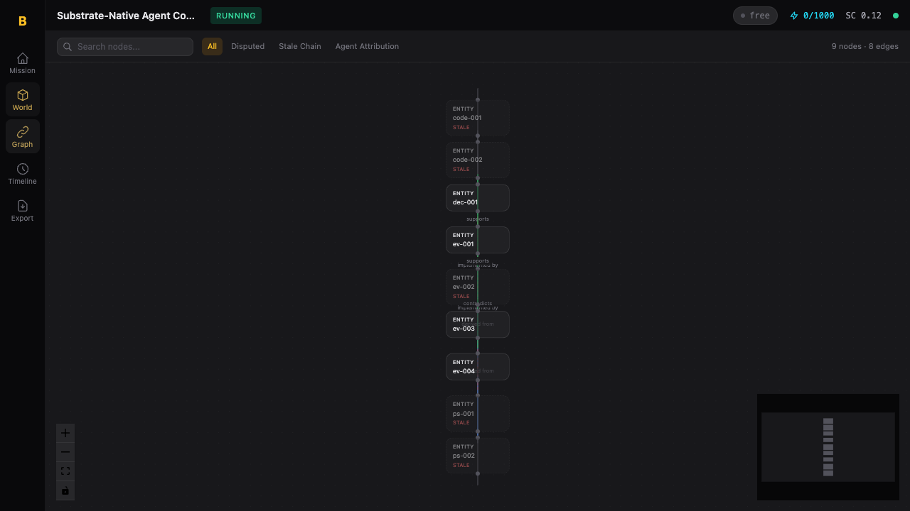
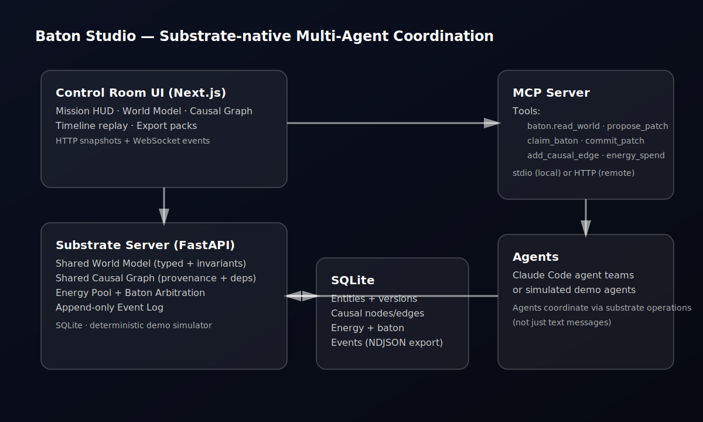
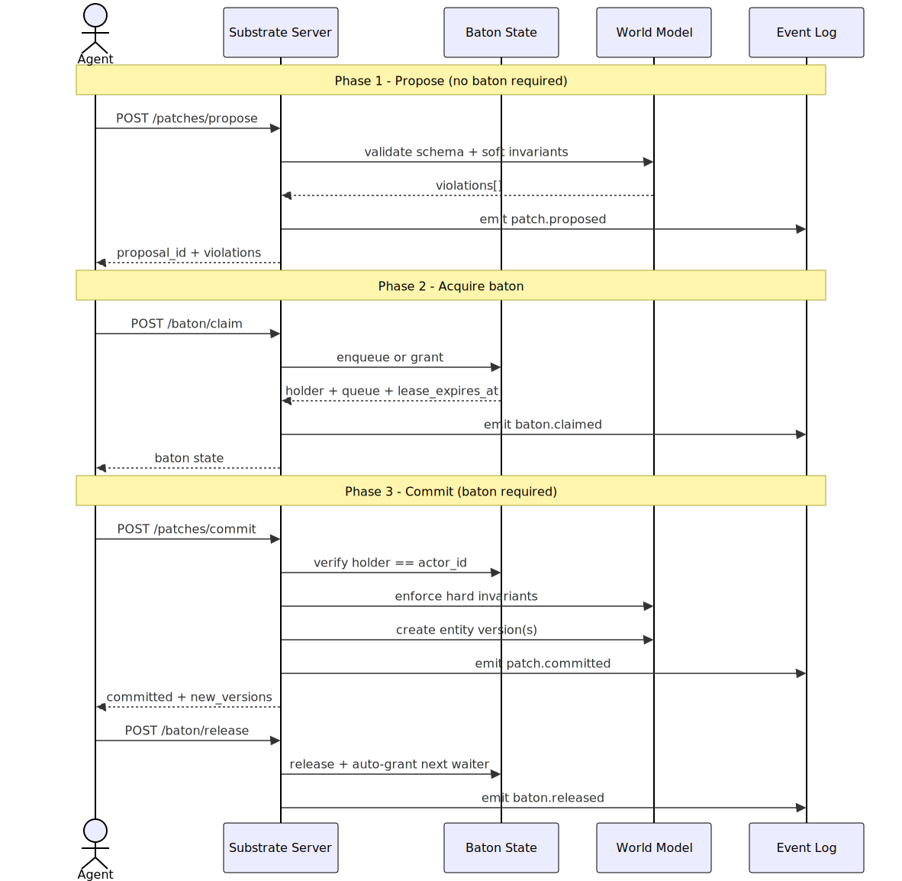

# Baton Studio

Control-room UI and shared substrate for multi-agent work: a typed world model, causal graph, energy budget, baton arbitration, and replayable event log running locally on FastAPI, SQLite, Next.js, and MCP.

[](https://www.python.org/)
[](https://nodejs.org/)
[](LICENSE)

## What This Repo Ships

- A local-first backend in [backend](backend)
- A Next.js control-room UI in [frontend](frontend)
- An MCP server in [mcp_server](mcp_server)
- A one-click demo mission with no API keys required
- Import/export of mission packs as `.zip` archives
- Playwright coverage that self-starts the app and refreshes screenshots under `assets/ui/`

## Screens

### Mission Control



### World Model



### Causal Graph



## Quickstart

Prerequisites:

- Python 3.11+
- [uv](https://docs.astral.sh/uv/)
- Node 20+
- [pnpm](https://pnpm.io/)

Run the full app:

```bash
git clone <repo-url> baton-studio
cd baton-studio
make dev
```

Then open [http://localhost:3000](http://localhost:3000) and click `Load Demo Mission`.

## Commands

```bash
make dev    # backend + frontend in watch mode
make check  # backend lint/format/typecheck/tests + frontend lint/typecheck + MCP smoke tests
make e2e    # self-started Playwright run with isolated test DB; refreshes assets/ui/*.png
make demo   # writes dist/demo_pack.zip and builds the frontend
```

Notes:

- `make e2e` starts both services automatically; you do not need a second terminal.
- `make e2e` uses an isolated SQLite database under `dist/` so it does not reuse your local working DB.
- `make demo` produces `dist/demo_pack.zip`, an importable mission pack containing `mission_pack.json`.

## Architecture

### System layout



### Write protocol



### Baton arbitration



### Causal graph model



### Data model



More detail lives in:

- [docs/ARCHITECTURE.md](docs/ARCHITECTURE.md)
- [docs/API_SPEC.md](docs/API_SPEC.md)
- [docs/DATA_MODEL.md](docs/DATA_MODEL.md)
- [docs/MCP_SPEC.md](docs/MCP_SPEC.md)
- [docs/UX_SPEC.md](docs/UX_SPEC.md)
- [docs/ACCEPTANCE_CHECKLIST.md](docs/ACCEPTANCE_CHECKLIST.md)

## Demo Flow

The built-in demo is a one-click scripted mission. Loading it creates a mission, populates the world model, builds the causal graph, emits timeline events, and updates the baton/energy HUD without a separate “start simulation” step.

After loading the demo you can:

- Inspect entities and version history in `World`
- Inspect nodes and edges in `Graph`
- Replay the event stream in `Timeline`
- Export the mission as a `.zip` from `Export`

## MCP Integration

Start the backend first:

```bash
make dev
```

Then add the MCP server from another project:

```bash
claude mcp add baton-studio -- \
  uv run --project /absolute/path/to/baton-studio/mcp_server \
  baton-mcp-server
```

If the backend is not on the default port:

```bash
BATON_BACKEND_URL=http://localhost:8787 \
claude mcp add baton-studio -- \
  uv run --project /absolute/path/to/baton-studio/mcp_server \
  baton-mcp-server
```

Available tools are defined in [docs/MCP_SPEC.md](docs/MCP_SPEC.md). The current server exposes the `baton.*` health, world, patch, baton, causal, and energy operations implemented in [mcp_server/main.py](mcp_server/main.py).

## Repo Layout

```text
backend/        FastAPI substrate server, demo simulator, services, pytest suite
frontend/       Next.js app, typed API client, Playwright suite
mcp_server/     Stdio MCP bridge that proxies to the backend HTTP API
assets/         Brand assets, rendered diagrams, generated UI screenshots
docs/           Product, architecture, API, UX, MCP, troubleshooting, acceptance docs
scripts/        Repo utilities such as diagram rendering
```

## Regenerating Artifacts

Refresh diagrams:

```bash
./scripts/render_diagrams.sh
```

Refresh screenshots:

```bash
make e2e
```

## Development Notes

- Backend tests are in [backend/tests](backend/tests).
- Frontend E2E tests are in [frontend/tests](frontend/tests).
- MCP smoke tests are in [mcp_server/tests](mcp_server/tests).

For contribution workflow and common issues, see [CONTRIBUTING.md](CONTRIBUTING.md) and [docs/TROUBLESHOOTING.md](docs/TROUBLESHOOTING.md).
